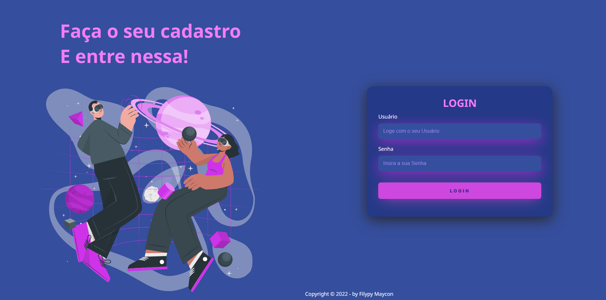

<h1 align="center"></h1>

## :camera: Demo

# Página de Login
Pagina de login muito atraente usando os padroes de UX/UI, sendo totalmente responsivo.

# Projeto Front-end

  - [x] HTML5
  - [x] CSS3
  - [x] RESPONSIVE

## Deploy on Vercel

[Click aqui](https://page-login-mocha.vercel.app/) para ver a live preview deste projeto.

## Aponte a sua camera aqui

  
  

